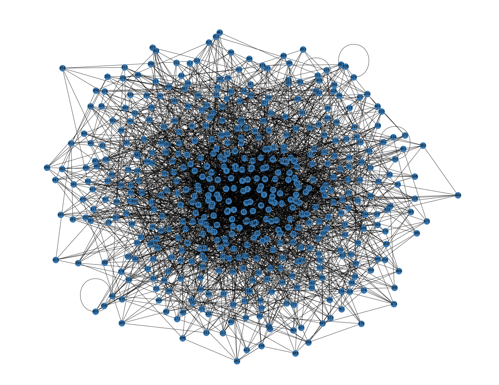
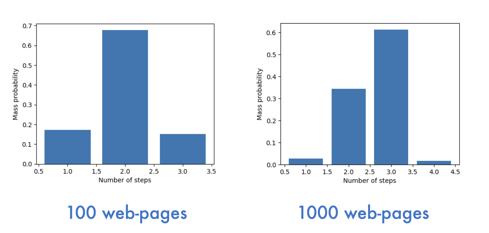
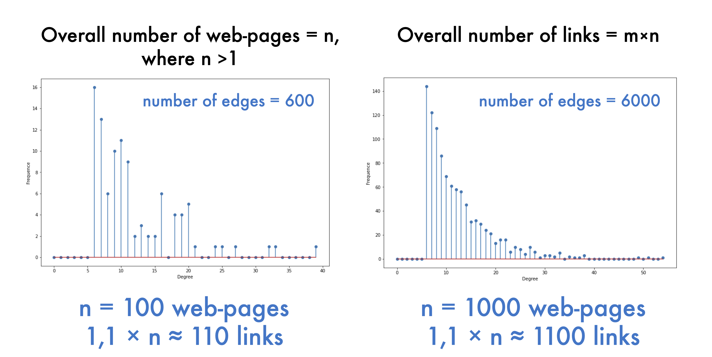
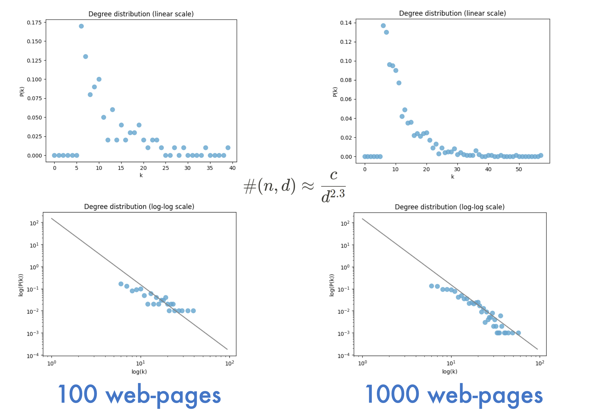

<a name="readme-top"></a>
<p>

<p>

# Page Rank (Barabassi-Albert algorithm)
Web-graph implementation on Python based on _Barabasi-Albert algorithm_.

<!-- TABLE OF CONTENTS -->
<details>
  <summary>Table of Contents</summary>
  <ol>
    <li>
      <a href="#getting-started">Getting started</a>
      <ul>
        <li><a href="#packages-installation">Packages installation</a></li>
        <li><a href="#usage-example">Usage example</a></li>
        <li><a href="#screenshots">Screenshots</a></li>
      </ul>
    </li>
    <li>
      <a href="#general-information">General information</a>
      <ul>
        <li><a href="#barabási-albert-algorithm">Barabási-Albert algorithm</a></li>
        <li><a href="#properties-of-our-web-graph">Properties of our web-graph</a></li>
      </ul>
    </li>
    <li><a href="#references">References</a></li>
    <li><a href="#contacts">Contacts</a></li>
    <li><a href="#license">License</a></li>
  </ol>
</details>

<!-- GETTING STARTED -->
## **Getting Started**
This is an example of how you may start using our web-graph model.

### Packages installation

This is a list of packages that are used in this project.
  ```python
  !pip install networkx
  !pip install numpy
  !pip install random
  !pip install matplotlib
  from IPython.display import clear_output
  clear_output()
  ```

### Usage example
  ```python
  '''
  Create graph with next parameters:

  m: int, default = 1
  define maximum number of line from one node

  number_of_nodes: int, default = 10
  define number of nodes in graph

  to_draw: bool, default = False
  set visibility of graph

  node_size: int, default = 50
  define node size

  with_labels: bool, default = True

  node_color: color or array of colors, default = '#1f77b4', 
  
  figsize: (float, float), default = (25, 20)
  '''

  current_graph = graph_model(
                      m = 6, 
                      to_draw = True, 
                      number_of_nodes = 500, 
                      node_size = 500
                  )
  ```

### Screenshots


<p align="center">Example of web-graph with parameters from usage examples</p>

## **General information**

### Barabási-Albert algorithm
Idea of preferential attachement

$$
p = 
 \begin{cases}
   \frac{k_i}{2t-1}, &\text{if } 1 \leq{i} \leq{t-1}\\
   \frac{1}{2t-1}, &\text{if } i = t
 \end{cases}
$$

### Properties of our web-graph

#### 1 Rule of six handshakes


#### 2 Sparseness


#### 3 Probability that the vertex of the graph has degree _d_



## **References**
- This project was based on these papers:  
  [Albert-László Barabási, Network Science, Barabási–Albert model](https://barabasi.com/f/622.pdf)  
  ['KVANT', Popular Physics and Mathematics Journal  No. 4, 2012, pp.12-16](http://kvant.mccme.ru/pdf/2012/2012-04-b.pdf)

## **Contacts**
- [@barracuda049](https://github.com/barracuda049)
- [@GibsonGrid](https://github.com/GibsonGrid)

## **License**
MIT License

Copyright (c) 2023 Matvey Skripkin, Nikita Ligostaev

Permission is hereby granted, free of charge, to any person obtaining a copy
of this software and associated documentation files (the "Software"), to deal
in the Software without restriction, including without limitation the rights
to use, copy, modify, merge, publish, distribute, sublicense, and/or sell
copies of the Software, and to permit persons to whom the Software is
furnished to do so, subject to the following conditions:

The above copyright notice and this permission notice shall be included in all
copies or substantial portions of the Software.

THE SOFTWARE IS PROVIDED "AS IS", WITHOUT WARRANTY OF ANY KIND, EXPRESS OR
IMPLIED, INCLUDING BUT NOT LIMITED TO THE WARRANTIES OF MERCHANTABILITY,
FITNESS FOR A PARTICULAR PURPOSE AND NONINFRINGEMENT. IN NO EVENT SHALL THE
AUTHORS OR COPYRIGHT HOLDERS BE LIABLE FOR ANY CLAIM, DAMAGES OR OTHER
LIABILITY, WHETHER IN AN ACTION OF CONTRACT, TORT OR OTHERWISE, ARISING FROM,
OUT OF OR IN CONNECTION WITH THE SOFTWARE OR THE USE OR OTHER DEALINGS IN THE
SOFTWARE.